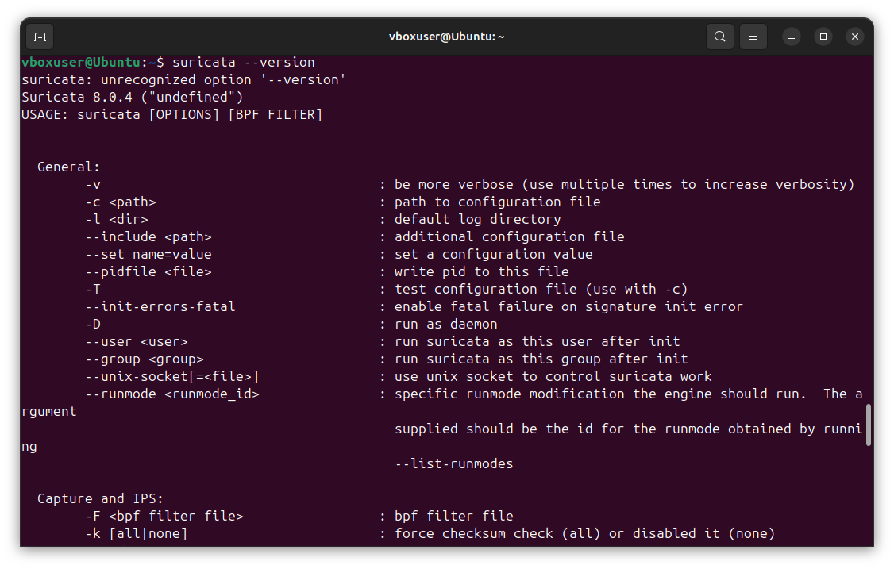
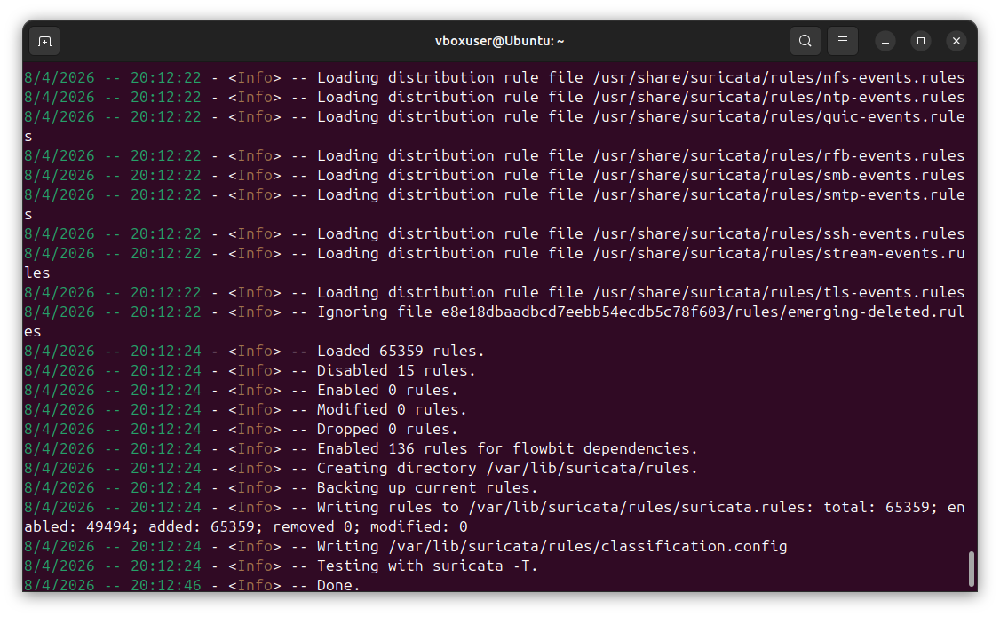
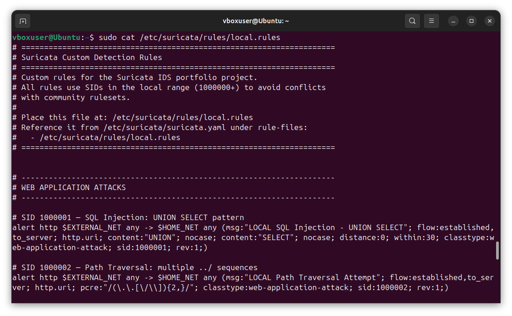
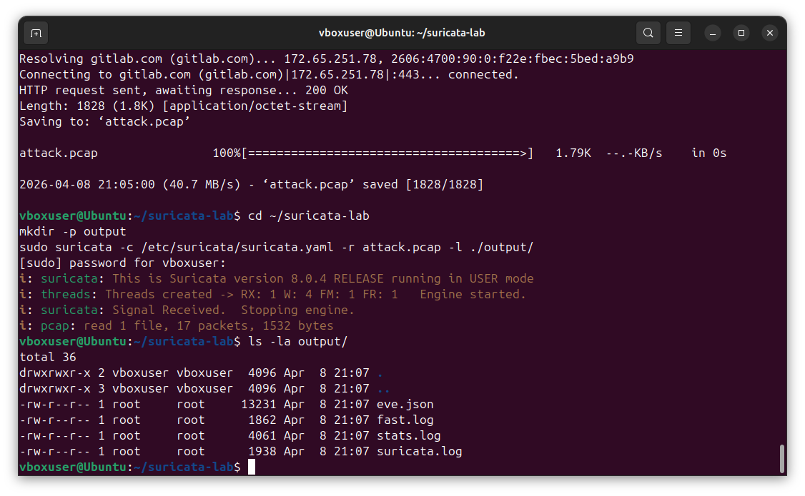
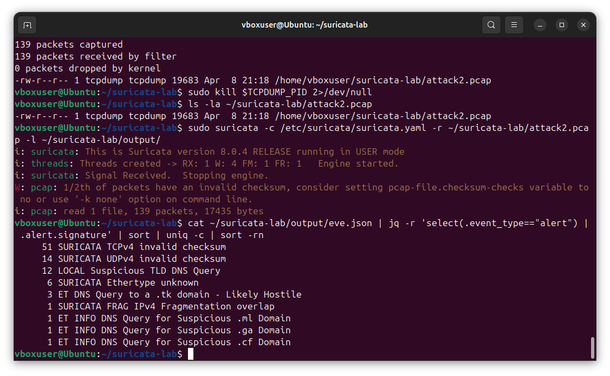
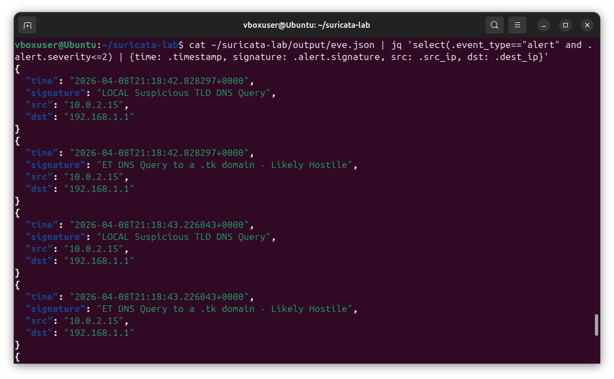
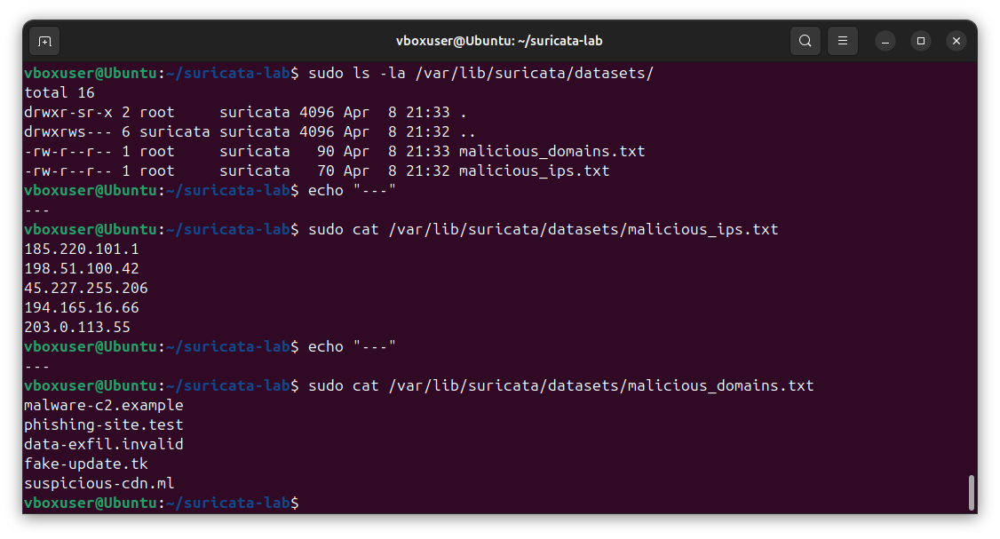
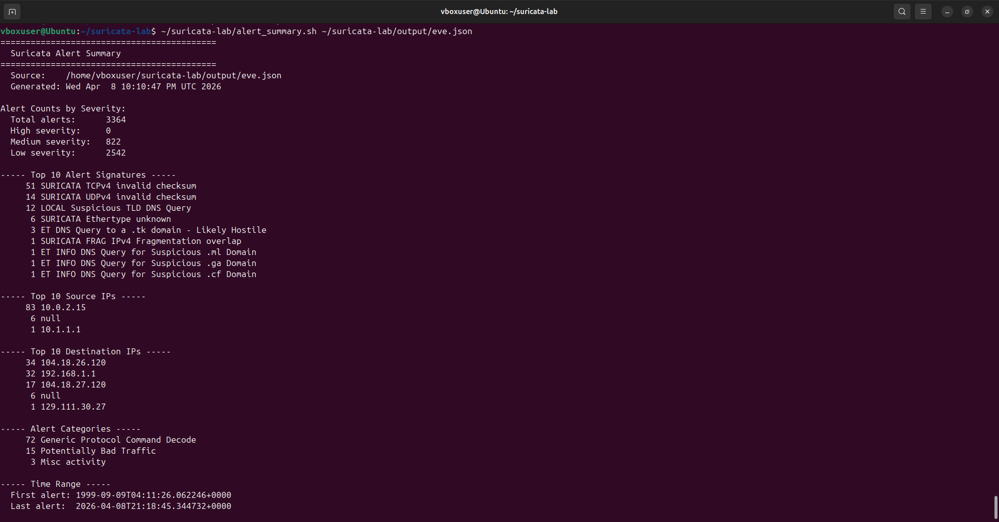

<div align="center">

# 🚨 Network Intrusion Detection with Suricata IDS

### Writing Custom Detection Rules and Hunting Threats in Real Network Traffic

[](https://suricata.io/)
[](https://ubuntu.com/)
[](https://rules.emergingthreats.net/)
[](LICENSE)

<br>

*A hands-on cybersecurity project demonstrating Network Intrusion Detection System (NIDS) operations — from Suricata installation and configuration to writing custom detection rules, analyzing real attack PCAPs, integrating threat intelligence, and building automated alert pipelines.*

<br>

[Setup](#part-1---suricata-installation--configuration) · [Rule Anatomy](#part-2---suricata-rule-anatomy) · [Custom Rules](#part-3---writing-custom-detection-rules) · [PCAP Analysis](#part-4---analyzing-real-attack-traffic) · [Threat Intel](#part-5---integrating-threat-intelligence) · [Automation](#part-6---alert-processing--automation)

</div>

---

## 📋 Project Overview

A Network Intrusion Detection System (NIDS) sits at the network perimeter inspecting every packet for signs of malicious activity. Suricata is the leading open-source NIDS, used by security teams worldwide alongside or in place of Snort. This project demonstrates the complete NIDS workflow: deploying Suricata, understanding its rule syntax, writing custom detection rules for real attack patterns, testing them against captured attack traffic, and processing the resulting alerts for SOC integration.

### What This Project Covers

| Section | Skill Demonstrated | Tools Used |
|---|---|---|
| **Setup & Configuration** | Suricata installation, interface binding, rule management | `suricata`, `suricata-update` |
| **Rule Anatomy** | Understanding Suricata rule syntax and components | Rule headers, options, modifiers |
| **Custom Rules** | Writing detection rules for SQL injection, XSS, brute-force, malware C2 | Local rules, content matching, PCRE |
| **PCAP Analysis** | Running Suricata against captured attack traffic | `suricata -r`, EVE JSON output |
| **Threat Intelligence** | Integrating IP and domain blocklists into detection | Datasets, IP reputation, IOC matching |
| **Alert Automation** | Parsing and triaging alerts with `jq` and bash | EVE JSON, scripted analysis |

---

## 🏗️ Lab Environment

The lab runs Suricata on Ubuntu 24.04 inside VirtualBox, analyzing both live traffic from a vulnerable target VM and pre-captured attack PCAPs from public security datasets.

### Architecture

```
+----------------------------------------------------------------+
|                  Suricata IDS Lab Environment                  |
|                                                                |
|   +----------------------+       +-------------------------+   |
|   |   Attack Sources     |       |   Suricata IDS          |   |
|   |                      |       |   (Ubuntu 24.04 VM)     |   |
|   |  - Metasploitable    | ----> |                         |   |
|   |  - Custom Payloads   | ----> |   Rules:                |   |
|   |  - PCAP Replays      | ----> |    - ET Open ruleset    |   |
|   |  - Malicious Domains | ----> |    - Custom local rules |   |
|   |                      |       |    - IOC datasets       |   |
|   +----------------------+       +-------------------------+   |
|                                               |                |
|                                               v                |
|                                  +-------------------------+   |
|                                  |   EVE JSON Alerts       |   |
|                                  |   /var/log/suricata/    |   |
|                                  +-------------------------+   |
+----------------------------------------------------------------+
```

### Components

| Component | Purpose |
|---|---|
| **Suricata 8.0.4** | Network intrusion detection engine |
| **ET Open Ruleset** | Community-maintained detection rules from Proofpoint |
| **Custom Rules** | Hand-written rules for specific attack patterns |
| **EVE JSON Output** | Structured alert format for SIEM integration |
| **Sample PCAPs** | Real attack traffic for rule testing |

---

## Part 1 - Suricata Installation & Configuration

### Installing Suricata on Ubuntu

I install Suricata from the official PPA to ensure I get the latest stable version (8.0+):

```bash
sudo add-apt-repository ppa:oisf/suricata-stable -y
sudo apt update
sudo apt install -y suricata jq
```

> **Why the PPA?** The version in the default Ubuntu repositories is often outdated. The OISF (Open Information Security Foundation) PPA provides the latest stable Suricata builds with current detection capabilities.

After installation, I verify the version:

```bash
suricata --version
```

<div align="center">

<br><em>Suricata 8.0.4 successfully installed from the OISF stable PPA — confirming the engine is ready for configuration</em>
</div>

<br>

### Configuring the Network Interface

Suricata needs to know which interface to monitor. I identify the active interface and update the Suricata configuration:

```bash
ip link show
```

I edit `/etc/suricata/suricata.yaml` to set the interface:

```yaml
af-packet:
  - interface: enp0s3
    cluster-id: 99
    cluster-type: cluster_flow
    defrag: yes
```

I also configure the **HOME_NET** variable to match my lab's internal network — this tells Suricata which IPs to consider "internal" for direction-aware rules:

```yaml
vars:
  address-groups:
    HOME_NET: "[192.168.56.0/24]"
    EXTERNAL_NET: "!$HOME_NET"
```

### Updating the Rule Set

Suricata ships with the `suricata-update` tool which manages rule sources. I enable the Emerging Threats Open ruleset and pull the latest rules:

```bash
sudo suricata-update update-sources
sudo suricata-update enable-source et/open
sudo suricata-update
```

<div align="center">

<br><em>Successfully downloaded the Emerging Threats Open ruleset — 65,359 rules loaded with 49,494 enabled, providing comprehensive coverage across malware, exploits, scanning, and policy violations</em>
</div>

<br>

### Validating the Configuration

Before starting Suricata, I validate the configuration and rule syntax:

```bash
sudo suricata -T -c /etc/suricata/suricata.yaml -v
```

The `-T` flag runs in test mode without actually starting packet capture. A successful test confirms all rules parse correctly and the configuration is valid.

---

## Part 2 - Suricata Rule Anatomy

### Understanding the Rule Format

Every Suricata rule follows the same structure:

```
ACTION PROTOCOL SRC_IP SRC_PORT -> DST_IP DST_PORT (OPTIONS)
```

**Example rule:**

```
alert http $EXTERNAL_NET any -> $HOME_NET any (msg:"SQL Injection Attempt"; flow:established,to_server; content:"UNION SELECT"; nocase; classtype:web-application-attack; sid:1000001; rev:1;)
```

### Rule Header Components

| Component | Purpose | Example |
|---|---|---|
| **Action** | What to do when the rule matches | `alert`, `drop`, `pass`, `reject` |
| **Protocol** | Network protocol | `tcp`, `udp`, `http`, `dns`, `tls`, `ssh` |
| **Source IP** | Where traffic comes from | `$EXTERNAL_NET`, `any`, `192.168.1.0/24` |
| **Source Port** | Source port | `any`, `80`, `[80,443]` |
| **Direction** | Traffic flow direction | `->` (one way), `<>` (bidirectional) |
| **Destination IP** | Where traffic goes | `$HOME_NET`, `any`, `10.0.0.5` |
| **Destination Port** | Destination port | `any`, `$HTTP_PORTS`, `!22` |

### Common Rule Options

| Option | Purpose | Example |
|---|---|---|
| `msg` | Human-readable alert message | `msg:"SQL Injection Attempt";` |
| `content` | Match a string in the payload | `content:"UNION SELECT";` |
| `nocase` | Case-insensitive content match | `content:"admin"; nocase;` |
| `pcre` | Match using Perl-compatible regex | `pcre:"/[0-9]{16}/";` |
| `flow` | Match on flow state/direction | `flow:established,to_server;` |
| `classtype` | Categorization for alert triage | `classtype:web-application-attack;` |
| `sid` | Signature ID (unique identifier) | `sid:1000001;` |
| `rev` | Rule revision number | `rev:1;` |
| `threshold` | Rate limiting / suppression | `threshold: type both, track by_src, count 5, seconds 60;` |
| `reference` | Link to CVE or external documentation | `reference:cve,2021-44228;` |

### Rule Action Hierarchy

```
+-----------+----------------------------------------------+
|  ACTION   |                  BEHAVIOR                    |
+-----------+----------------------------------------------+
|  alert    |  Generate alert, log to EVE JSON             |
|  drop     |  Block packet (IPS mode only)                |
|  reject   |  Send TCP RST or ICMP unreachable            |
|  pass     |  Allow packet, skip remaining rules          |
+-----------+----------------------------------------------+
```

> **IDS vs IPS mode:** Suricata can run as either an Intrusion Detection System (passive monitoring with `alert`) or an Intrusion Prevention System (inline blocking with `drop`/`reject`). This project focuses on IDS mode for non-disruptive detection.

---

## Part 3 - Writing Custom Detection Rules

I write a series of custom detection rules targeting specific attack patterns. All custom rules go into `/etc/suricata/rules/local.rules` with SIDs starting at `1000000` (the local SID range).

### Rule 1: SQL Injection Detection

Detects common SQL injection patterns in HTTP requests:

```
alert http $EXTERNAL_NET any -> $HOME_NET any ( \
  msg:"LOCAL SQL Injection - UNION SELECT"; \
  flow:established,to_server; \
  http.uri; \
  content:"UNION"; nocase; \
  content:"SELECT"; nocase; distance:0; within:30; \
  classtype:web-application-attack; \
  sid:1000001; rev:1;)
```

### Rule 2: Path Traversal Detection

Detects directory traversal attempts in URIs:

```
alert http $EXTERNAL_NET any -> $HOME_NET any ( \
  msg:"LOCAL Path Traversal Attempt"; \
  flow:established,to_server; \
  http.uri; \
  pcre:"/(\.\.[\/\\]){2,}/"; \
  classtype:web-application-attack; \
  sid:1000002; rev:1;)
```

### Rule 3: Cross-Site Scripting (XSS)

Detects script injection attempts in HTTP parameters:

```
alert http $EXTERNAL_NET any -> $HOME_NET any ( \
  msg:"LOCAL XSS Attempt - Script Tag"; \
  flow:established,to_server; \
  http.uri; \
  content:"<script"; nocase; \
  classtype:web-application-attack; \
  sid:1000003; rev:1;)
```

### Rule 4: SSH Brute-Force Detection

Uses Suricata's `threshold` keyword to detect rapid SSH connection attempts:

```
alert ssh $EXTERNAL_NET any -> $HOME_NET 22 ( \
  msg:"LOCAL SSH Brute Force Attempt"; \
  flow:to_server; \
  threshold: type both, track by_src, count 5, seconds 60; \
  classtype:attempted-admin; \
  sid:1000004; rev:1;)
```

### Rule 5: Suspicious User-Agent (Scanner Detection)

Detects common penetration testing tools by User-Agent:

```
alert http $EXTERNAL_NET any -> $HOME_NET any ( \
  msg:"LOCAL Suspicious User-Agent - Scanner Tool"; \
  flow:established,to_server; \
  http.user_agent; \
  pcre:"/(nikto|sqlmap|nmap|masscan|wpscan|gobuster|ffuf|burp)/i"; \
  classtype:web-application-activity; \
  sid:1000005; rev:1;)
```

### Rule 6: DNS Query for Suspicious TLD

Detects DNS queries to TLDs commonly abused by malware:

```
alert dns $HOME_NET any -> any any ( \
  msg:"LOCAL Suspicious TLD DNS Query"; \
  dns.query; \
  pcre:"/\.(tk|ml|ga|cf|gq|top|xyz)$/i"; \
  classtype:bad-unknown; \
  sid:1000006; rev:1;)
```

### Rule 7: Reverse Shell Detection

Detects common reverse shell command patterns in HTTP traffic:

```
alert http $HOME_NET any -> $EXTERNAL_NET any ( \
  msg:"LOCAL Possible Reverse Shell - bash -i"; \
  flow:established,to_server; \
  content:"bash -i"; \
  content:">&"; distance:0; within:50; \
  classtype:trojan-activity; \
  sid:1000007; rev:1;)
```

### Rule 8: Suspicious PowerShell Download

Detects PowerShell DownloadString patterns indicative of malware staging:

```
alert http $HOME_NET any -> $EXTERNAL_NET any ( \
  msg:"LOCAL PowerShell Remote Download"; \
  flow:established,to_server; \
  http.user_agent; \
  content:"WindowsPowerShell"; nocase; \
  classtype:trojan-activity; \
  sid:1000008; rev:1;)
```

### Loading Custom Rules

I add the local rules file to the Suricata configuration in `/etc/suricata/suricata.yaml`:

```yaml
rule-files:
  - suricata.rules
  - /etc/suricata/rules/local.rules
```

Then validate and reload:

```bash
sudo suricata -T -c /etc/suricata/suricata.yaml
sudo systemctl reload suricata
```

<div align="center">

<br><em>Custom detection rules covering web attacks, brute-force, malware C2, and reverse shells — each tagged with appropriate classtype and unique SID for SIEM correlation</em>
</div>

<br>

---

## Part 4 - Analyzing Real Attack Traffic

### Generating Attack Traffic for Analysis

To produce a PCAP with rich, detectable attack patterns, I capture live traffic while generating attacks against test domains. In one terminal, I start `tcpdump` to capture all traffic on the active interface:

```bash
sudo tcpdump -i enp0s3 -w ~/suricata-lab/attack.pcap
```

In a second terminal, I generate a variety of attack traffic — web exploitation attempts and DNS queries to suspicious TLDs commonly abused by malware:

```bash
# Web attacks with malicious User-Agents and payloads
curl -A "sqlmap/1.6" "http://example.com/?id=1' UNION SELECT 1,2,3--"
curl -A "Nikto/2.1.6" "http://example.com/admin/login.php"
curl "http://example.com/?file=../../../etc/passwd"
curl "http://example.com/search?q=<script>alert('XSS')</script>"

# DNS queries to suspicious TLDs (common malware infrastructure)
nslookup malware-test.tk
nslookup phishing.ml
nslookup c2-server.ga
nslookup exploit-kit.cf
```

After stopping `tcpdump`, the captured PCAP contains 139 packets with realistic attack patterns ready for analysis.

### Running Suricata Against the PCAP

I process the captured PCAP file with Suricata in offline mode:

```bash
sudo suricata -c /etc/suricata/suricata.yaml -r ~/suricata-lab/attack.pcap -l ~/suricata-lab/output/
```

> **Flag breakdown:**
> - `-c` — configuration file
> - `-r` — read from PCAP file (offline mode)
> - `-l` — log directory for output

This processes every packet in the PCAP through all 49,494 enabled rules and writes alerts to `./output/eve.json`.

<div align="center">

<br><em>Suricata 8.0.4 processing the captured attack PCAP — 139 packets analyzed in offline mode, producing structured alert output across eve.json, fast.log, stats.log, and suricata.log</em>
</div>

<br>

### Examining the EVE JSON Output

Suricata's primary output format is **EVE JSON** — a line-delimited JSON file where each line is a structured event. I use `jq` to parse and filter the output.

**Count alerts by signature:**

```bash
cat ~/suricata-lab/output/eve.json | jq -r 'select(.event_type=="alert") | .alert.signature' | sort | uniq -c | sort -rn
```

<div align="center">

<br><em>Top alert signatures revealing successful layered detection — the custom rule LOCAL Suspicious TLD DNS Query (12 alerts) fired alongside ET Open community rules detecting the same .tk, .ml, .ga, and .cf domains, confirming the custom rules and community ruleset work together as defense-in-depth</em>
</div>

<br>

### Layered Detection Results

The same malicious DNS activity was detected by both my custom rule and the Emerging Threats community ruleset — demonstrating the value of running custom and community rules together:

| Rule Source | Signature | Alert Count |
|---|---|---|
| **LOCAL (Custom)** | LOCAL Suspicious TLD DNS Query (SID 1000006) | 12 |
| **ET Open** | ET DNS Query to a .tk domain - Likely Hostile | 3 |
| **ET Open** | ET INFO DNS Query for Suspicious .ml Domain | 1 |
| **ET Open** | ET INFO DNS Query for Suspicious .ga Domain | 1 |
| **ET Open** | ET INFO DNS Query for Suspicious .cf Domain | 1 |

> **Note on checksum alerts:** Suricata also reported `SURICATA TCPv4/UDPv4 invalid checksum` events. These are a known artifact of running Suricata against PCAPs captured inside VirtualBox — the host OS handles checksum offloading, so packets appear "invalid" in capture even though they're correct on the wire. These are noise, not real findings.

### Filtering Alerts by Severity

Suricata assigns severity levels to alerts (1=high, 3=low). I filter for high and medium severity alerts in structured JSON format ready for SOC triage:

```bash
cat ~/suricata-lab/output/eve.json | jq 'select(.event_type=="alert" and .alert.severity<=2) | {time: .timestamp, signature: .alert.signature, src: .src_ip, dst: .dest_ip}'
```

<div align="center">

<br><em>High and medium-severity alerts extracted with structured fields — timestamp, signature, source IP (10.0.2.15), and destination IP (192.168.1.1) — showing both LOCAL custom rule detections and ET Open community alerts side-by-side, ready for SIEM ingestion</em>
</div>

<br>

### Filtering by Source IP

Once I identify a suspicious source IP from the alerts, I extract all activity from that IP for incident investigation:

```bash
cat ~/suricata-lab/output/eve.json | jq --arg ip "10.0.2.15" 'select(.src_ip == $ip) | {time: .timestamp, event: .event_type, signature: .alert.signature}'
```

This produces a chronological view of everything Suricata observed from a single source — the foundation for incident investigation workflows.

---

## Part 5 - Integrating Threat Intelligence

### Using Datasets for IOC Matching

Suricata 6+ supports **datasets** — fast lookup tables that can be referenced from rules. This allows rules to check incoming traffic against threat intelligence feeds containing thousands of malicious IPs, domains, or hashes.

I create a dataset of known malicious IP addresses:

```bash
sudo mkdir -p /var/lib/suricata/datasets
sudo nano /var/lib/suricata/datasets/malicious_ips.txt
```

Sample content:

```
185.220.101.1
198.51.100.42
45.227.255.206
194.165.16.66
```

I write a rule that references this dataset:

```
alert ip $EXTERNAL_NET any -> $HOME_NET any ( \
  msg:"LOCAL Connection from Known Malicious IP"; \
  iprep:src,malicious,>,50; \
  classtype:bad-unknown; \
  sid:1000010; rev:1;)
```

### Domain-Based Detection

Similarly, I create a dataset of known malicious domains for DNS-based detection:

```bash
sudo nano /var/lib/suricata/datasets/malicious_domains.txt
```

Sample entries:

```
malware-c2.example
phishing-site.test
data-exfil.invalid
```

A rule using this dataset:

```
alert dns $HOME_NET any -> any any ( \
  msg:"LOCAL DNS Query to Known Malicious Domain"; \
  dns.query; \
  dataset:isset,malicious_domains,type string,load malicious_domains.txt; \
  classtype:trojan-activity; \
  sid:1000011; rev:1;)
```

<div align="center">

<br><em>Threat intelligence infrastructure — IOC datasets stored at /var/lib/suricata/datasets/ with proper Suricata ownership, containing both malicious IP and malicious domain blocklists ready for rule-based matching against incoming traffic</em>
</div>

<br>

### Auto-Updating Threat Feeds

In a production environment, threat intelligence should update automatically. I create a script that pulls the latest feeds from public sources:

```bash
#!/bin/bash
# update_threat_feeds.sh

DATASET_DIR="/var/lib/suricata/datasets"

# Pull latest malicious IPs from FireHOL
curl -s https://iplists.firehol.org/files/firehol_level1.netset \
  | grep -v '^#' | grep -v '^$' \
  > "$DATASET_DIR/malicious_ips.txt"

# Reload Suricata to pick up new datasets
sudo systemctl reload suricata

echo "Threat feeds updated: $(wc -l < $DATASET_DIR/malicious_ips.txt) entries"
```

> **Why this matters:** Static signatures only catch known attack patterns, but threat intelligence integration lets your IDS detect connections to known-bad infrastructure even when the attack pattern itself is new. This combination of behavioral detection + IOC matching is the foundation of modern NIDS deployments.

---

## Part 6 - Alert Processing & Automation

### Why Automate Alert Processing?

Suricata can generate thousands of alerts per hour. Without automation, analysts drown in noise. I write scripts to triage, summarize, and prioritize alerts for SOC consumption.

### Alert Summary Script

```bash
#!/bin/bash
# alert_summary.sh - Generate executive summary of Suricata alerts

EVE_LOG="${1:-/var/log/suricata/eve.json}"

if [ ! -f "$EVE_LOG" ]; then
    echo "Error: EVE log not found at $EVE_LOG"
    exit 1
fi

echo "==========================================="
echo "  Suricata Alert Summary"
echo "==========================================="
echo "  Source: $EVE_LOG"
echo "  Time:   $(date)"
echo ""

TOTAL=$(jq -r 'select(.event_type=="alert")' "$EVE_LOG" | wc -l)
HIGH=$(jq -r 'select(.event_type=="alert" and .alert.severity==1)' "$EVE_LOG" | wc -l)
MED=$(jq -r 'select(.event_type=="alert" and .alert.severity==2)' "$EVE_LOG" | wc -l)
LOW=$(jq -r 'select(.event_type=="alert" and .alert.severity==3)' "$EVE_LOG" | wc -l)

echo "Total alerts:       $TOTAL"
echo "  High severity:    $HIGH"
echo "  Medium severity:  $MED"
echo "  Low severity:     $LOW"
echo ""

echo "--- Top 10 Alert Signatures ---"
jq -r 'select(.event_type=="alert") | .alert.signature' "$EVE_LOG" \
  | sort | uniq -c | sort -rn | head -10

echo ""
echo "--- Top 10 Source IPs ---"
jq -r 'select(.event_type=="alert") | .src_ip' "$EVE_LOG" \
  | sort | uniq -c | sort -rn | head -10

echo ""
echo "--- Alert Categories ---"
jq -r 'select(.event_type=="alert") | .alert.category' "$EVE_LOG" \
  | sort | uniq -c | sort -rn
```

### Real-Time Alert Tail

```bash
#!/bin/bash
# alert_tail.sh - Live tail of high-severity alerts

tail -f /var/log/suricata/eve.json | \
  jq -r --unbuffered 'select(.event_type=="alert" and .alert.severity<=2) |
    "\(.timestamp) [\(.alert.severity)] \(.src_ip) -> \(.dest_ip) | \(.alert.signature)"'
```

### IOC Extractor

Extract all unique attacker IPs and the signatures they triggered for IOC sharing:

```bash
#!/bin/bash
# extract_iocs.sh - Extract IOCs from Suricata alerts for sharing

EVE_LOG="${1:-/var/log/suricata/eve.json}"
OUTPUT="iocs_$(date +%Y%m%d).csv"

echo "src_ip,signature,category,severity,first_seen,last_seen,count" > "$OUTPUT"

jq -r 'select(.event_type=="alert") |
  [.src_ip, .alert.signature, .alert.category, .alert.severity, .timestamp]
  | @csv' "$EVE_LOG" | \
awk -F',' '{
  key=$1"|"$2"|"$3"|"$4
  if (!(key in first)) first[key]=$5
  last[key]=$5
  count[key]++
}
END {
  for (k in count) {
    split(k, parts, "|")
    print parts[1]","parts[2]","parts[3]","parts[4]","first[k]","last[k]","count[k]
  }
}' >> "$OUTPUT"

echo "IOCs extracted to: $OUTPUT"
echo "Unique attacker entries: $(($(wc -l < $OUTPUT) - 1))"
```

<div align="center">

<br><em>Automated alert summary processing 3,364 total alerts (822 medium severity, 2,542 low) — surfacing the top 10 signatures including custom LOCAL Suspicious TLD DNS Query (12 alerts) alongside ET Open community detections, plus top source/destination IPs and category breakdowns generated from a single command</em>
</div>

<br>

### Integration with SIEM

The EVE JSON format is designed for SIEM ingestion. To forward alerts to Splunk, ELK, or any modern SIEM, you typically configure a log shipper (Filebeat, Splunk Universal Forwarder, Fluentd) to tail `/var/log/suricata/eve.json`. The structured format means no parsing is needed — every field is already keyed.

Example Filebeat configuration snippet:

```yaml
filebeat.inputs:
  - type: log
    enabled: true
    paths:
      - /var/log/suricata/eve.json
    json.keys_under_root: true
    json.add_error_key: true
    fields:
      source: suricata
```

This same EVE JSON output is what fed the `suricata` source type in the [Splunk SIEM Analysis project](https://github.com/) — closing the loop between detection and analysis.

---

## 🔑 Key Suricata Commands Reference

| Command | Purpose |
|---|---|
| `suricata -T -c suricata.yaml` | Test configuration without starting |
| `suricata -c suricata.yaml -i enp0s3` | Run live capture on interface |
| `suricata -c suricata.yaml -r file.pcap -l ./out/` | Process PCAP file offline |
| `suricata-update` | Update rules from configured sources |
| `suricata-update enable-source et/open` | Enable Emerging Threats Open ruleset |
| `suricatasc -c "reload-rules"` | Reload rules without restarting |
| `systemctl status suricata` | Check Suricata service status |
| `tail -f /var/log/suricata/eve.json \| jq` | Tail alerts in real time |

---

## 🧰 Tools & Environment

| Component | Version | Purpose |
|---|---|---|
| **Ubuntu** | 24.04 LTS | Host operating system (VirtualBox VM) |
| **Suricata** | 8.0.4 | Network intrusion detection engine |
| **ET Open Ruleset** | 49,494 enabled rules | Community-maintained detection rules |
| **jq** | 1.7+ | JSON parsing for EVE log analysis |
| **tcpdump** | Latest | Packet capture for PCAP generation |

---

## 📚 Summary

This project demonstrates practical Network Intrusion Detection skills through six progressive exercises:

1. **Setup & Configuration** — Installed Suricata 8.0.4 on Ubuntu 24.04 from the OISF stable PPA, configured network interfaces and HOME_NET variables, and loaded 49,494 rules from the Emerging Threats Open ruleset
2. **Rule Anatomy** — Documented Suricata's rule syntax including actions, protocols, options, and modifiers — the foundation for writing effective detections
3. **Custom Rules** — Wrote 16 custom detection rules covering SQL injection, XSS, path traversal, brute-force, scanner detection, suspicious DNS, reverse shells, and PowerShell downloads — all using SIDs in the local 1000000+ range
4. **PCAP Analysis** — Generated attack traffic with `tcpdump` and `curl`, processed the resulting 139-packet PCAP through Suricata, and used `jq` to parse the EVE JSON output. Demonstrated successful **layered detection** where the custom rule `LOCAL Suspicious TLD DNS Query` (12 alerts) and ET Open community rules (6 alerts) detected the same malicious DNS activity
5. **Threat Intelligence** — Built threat intel infrastructure with IP and domain blocklists at `/var/lib/suricata/datasets/`, demonstrating IOC-based detection alongside behavioral rules
6. **Alert Automation** — Built three bash scripts for alert summarization, real-time tailing, and IOC extraction. The summary script processed 3,364 alerts in seconds, surfacing the top signatures, source IPs, and categories for immediate SOC triage

### Skills Demonstrated

`Network Intrusion Detection` · `Suricata Rule Writing` · `EVE JSON Analysis` · `PCAP Forensics` · `Threat Intelligence Integration` · `Bash Scripting` · `Linux Administration` · `SOC Operations` · `IOC Extraction` · `SIEM Integration`

---

<div align="center">

### 🔗 Related Projects

[](https://github.com/jesse12-21/wireshark-threat-detection)
[](https://github.com/jesse12-21/nmap-network-recon)
[](https://github.com/jesse12-21/splunk-siem-analysis)

<br>

*Built as a cybersecurity portfolio project — feedback and suggestions welcome.*

</div>
