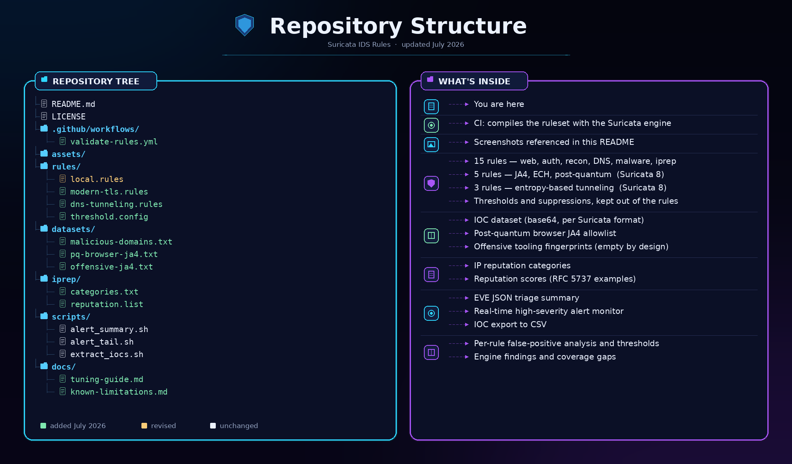
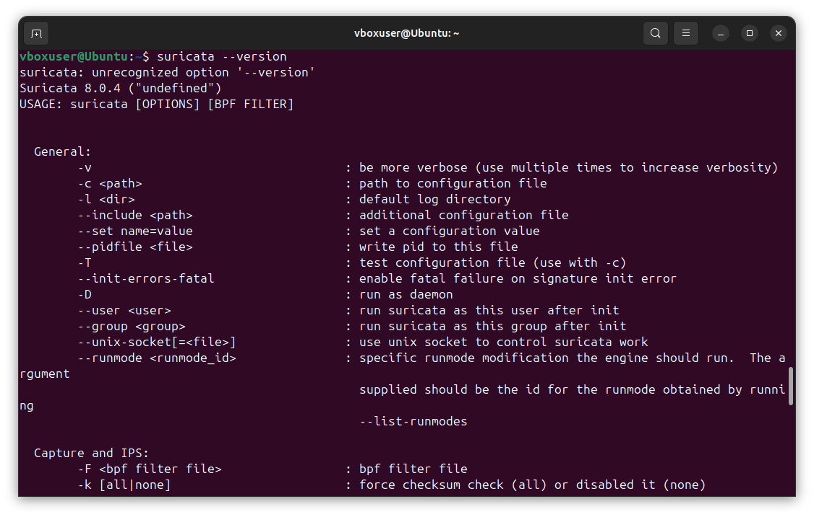
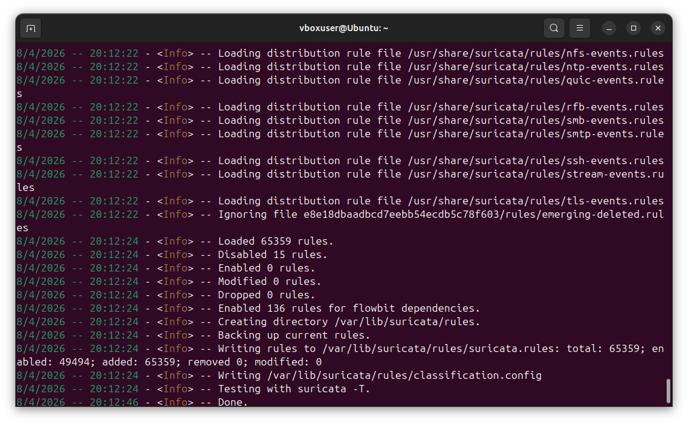
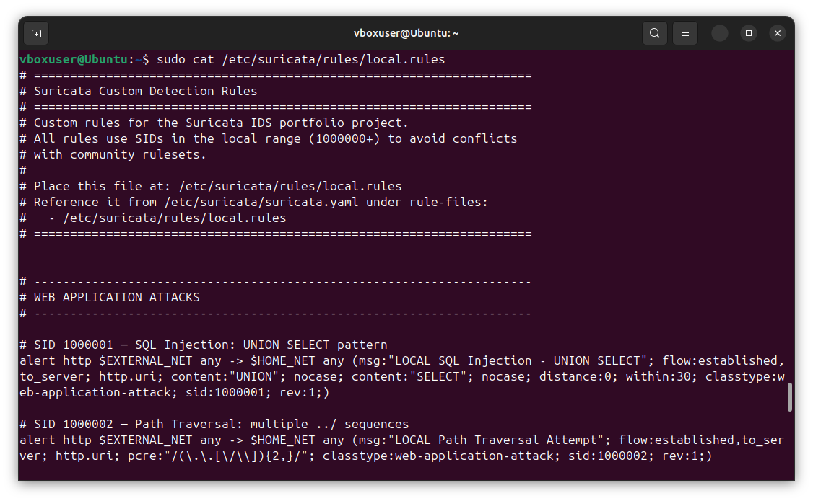
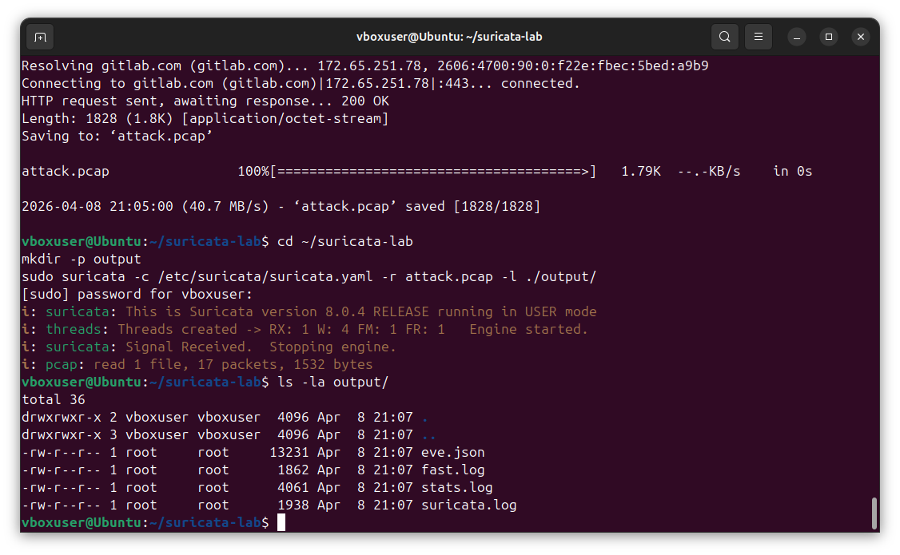
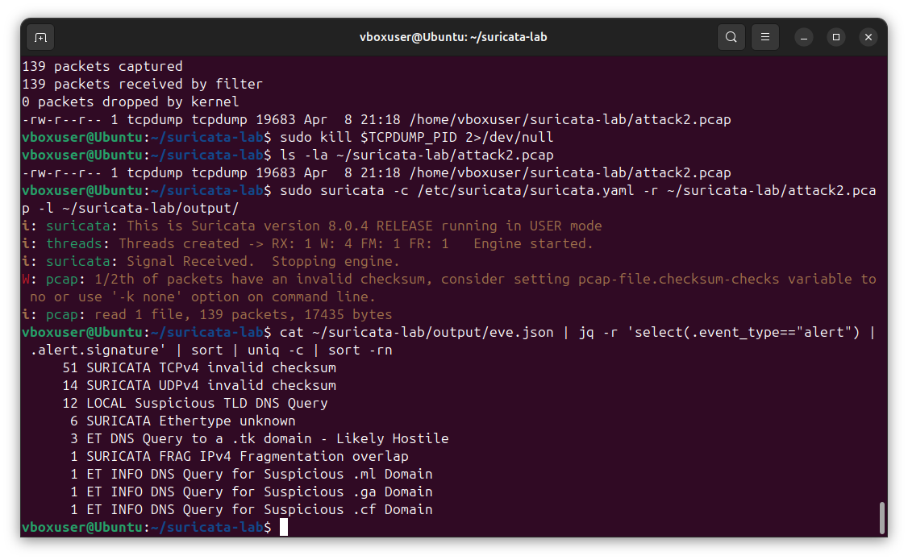
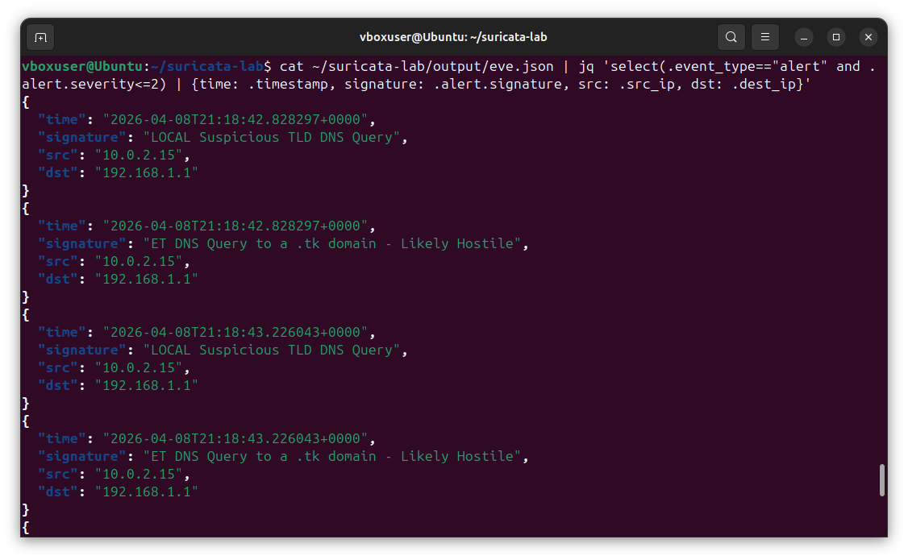
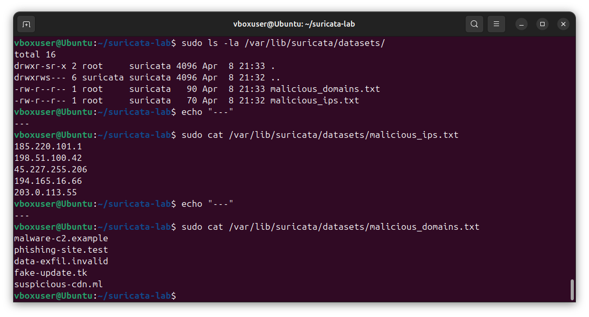
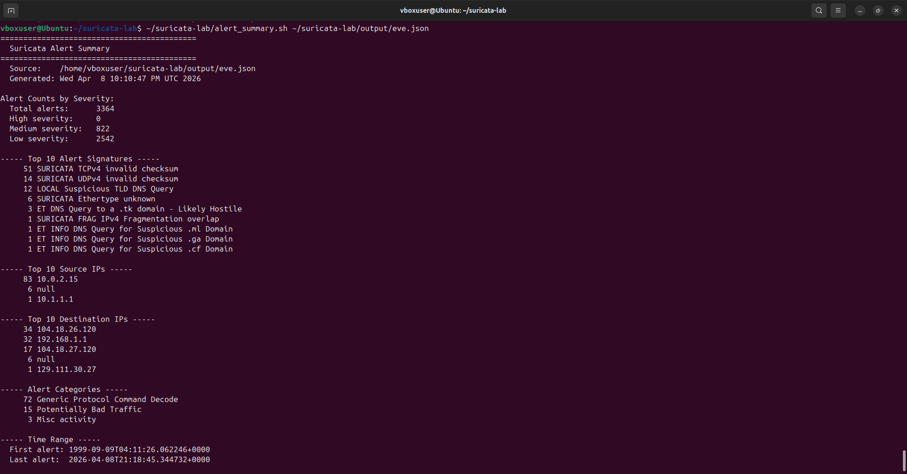

<div align="center">

# 🚨 Network Intrusion Detection with Suricata IDS

### Writing Custom Detection Rules and Hunting Threats in Real Network Traffic

[](https://suricata.io/)
[](https://ubuntu.com/)
[](https://rules.emergingthreats.net/)
[](https://attack.mitre.org/)
[](../../actions/workflows/validate-rules.yml)

<br>

*A hands-on cybersecurity project demonstrating Network Intrusion Detection System (NIDS) operations — from Suricata installation through writing and tuning custom detection rules, into modern encrypted-traffic detection (JA4, Encrypted Client Hello, post-quantum TLS), IPS deployment, and a detection-as-code pipeline where every rule is compiled by the engine itself in CI.*

<br>

[Setup](#part-1---suricata-installation--configuration) · [Rule Anatomy](#part-2---suricata-rule-anatomy) · [Custom Rules](#part-3---writing-custom-detection-rules) · [PCAP Analysis](#part-4---analyzing-real-attack-traffic) · [Threat Intel](#part-5---integrating-threat-intelligence) · [Automation](#part-6---alert-processing--automation) · [Modern TLS](#part-7---modern-tls-detections-ja4-ech-post-quantum) · [IDS→IPS](#part-8---from-ids-to-ips) · [Detection-as-Code](#part-9---detection-as-code)

</div>

---

## 📋 Project Overview

A Network Intrusion Detection System (NIDS) sits at the network perimeter inspecting every packet for signs of malicious activity. Suricata is the leading open-source NIDS, used by security teams worldwide alongside or in place of Snort. This project demonstrates the complete NIDS workflow: deploying Suricata, understanding its rule syntax, writing custom detection rules for real attack patterns, testing them against captured attack traffic, and processing the resulting alerts for SOC integration.

### What This Project Covers

| Section | Skill Demonstrated | Tools Used |
|---|---|---|
| **Setup & Configuration** | Suricata installation, interface binding, rule management | `suricata`, `suricata-update` |
| **Rule Anatomy** | Understanding Suricata rule syntax and components | Rule headers, options, modifiers |
| **Custom Rules** | Writing detection rules for SQL injection, XSS, brute-force, malware C2 | Local rules, content matching, PCRE |
| **PCAP Analysis** | Running Suricata against captured attack traffic | `suricata -r`, EVE JSON output |
| **Threat Intelligence** | Integrating IP and domain blocklists into detection | Datasets, IP reputation, IOC matching |
| **Alert Automation** | Parsing and triaging alerts with `jq` and bash | EVE JSON, scripted analysis |
| **Modern TLS Detection** | JA4 fingerprinting, Encrypted Client Hello, post-quantum capability | `ja4.hash`, `absent`, `xbits`, `entropy` |
| **Rule Tuning** | False-positive analysis, thresholds, suppressions | `threshold.config`, phased deployment |
| **IPS Operations** | Inline deployment and drop-safety assessment | NFQUEUE, af-packet inline |
| **Detection-as-Code** | Engine-validated rules in CI, structured metadata | GitHub Actions, `suricata -T` |

---

## 🏗️ Lab Environment

The lab runs Suricata on Ubuntu 24.04 inside VirtualBox, analyzing both live traffic from a vulnerable target VM and pre-captured attack PCAPs from public security datasets.

### Architecture

```
+----------------------------------------------------------------+
|                  Suricata IDS Lab Environment                  |
|                                                                |
|   +----------------------+       +-------------------------+   |
|   |   Attack Sources     |       |   Suricata IDS          |   |
|   |                      |       |   (Ubuntu 24.04 VM)     |   |
|   |  - Metasploitable    | ----> |                         |   |
|   |  - Custom Payloads   | ----> |   Rules:                |   |
|   |  - PCAP Replays      | ----> |    - ET Open ruleset    |   |
|   |  - Malicious Domains | ----> |    - Custom local rules |   |
|   |                      |       |    - IOC datasets       |   |
|   +----------------------+       +-------------------------+   |
|                                               |                |
|                                               v                |
|                                  +-------------------------+   |
|                                  |   EVE JSON Alerts       |   |
|                                  |   /var/log/suricata/    |   |
|                                  +-------------------------+   |
+----------------------------------------------------------------+
```

### Components

| Component | Purpose |
|---|---|
| **Suricata 8.0.5** | Network intrusion detection engine |
| **ET Open Ruleset** | Community-maintained detection rules from Proofpoint |
| **Custom Rules** | Hand-written rules for specific attack patterns |
| **EVE JSON Output** | Structured alert format for SIEM integration |
| **Sample PCAPs** | Real attack traffic for rule testing |

### 🎯 Detection Coverage — MITRE ATT&CK Mapping

Every rule carries its ATT&CK technique in structured `metadata:`, so coverage can be measured programmatically rather than read off a table. CI enforces that no rule merges without it.

| Adversary Technique | ATT&CK ID | Tactic | Rules |
|---|---|---|---|
| **Exploit Public-Facing Application** | [T1190](https://attack.mitre.org/techniques/T1190/) | Initial Access | 1000001, 1000002, 1000003 |
| **File and Directory Discovery** | [T1083](https://attack.mitre.org/techniques/T1083/) | Discovery | 1000009 |
| **Brute Force: Password Guessing** | [T1110.001](https://attack.mitre.org/techniques/T1110/001/) | Credential Access | 1000004, 1000012 |
| **Active Scanning: Vulnerability Scanning** | [T1595.002](https://attack.mitre.org/techniques/T1595/002/) | Reconnaissance | 1000005 |
| **Active Scanning: Wordlist Scanning** | [T1595.003](https://attack.mitre.org/techniques/T1595/003/) | Reconnaissance | 1000013 |
| **Application Layer Protocol: DNS** | [T1071.004](https://attack.mitre.org/techniques/T1071/004/) | Command and Control | 1000006, 1000014, 1000202 |
| **Exfiltration Over Unencrypted Non-C2 Protocol** | [T1048.003](https://attack.mitre.org/techniques/T1048/003/) | Exfiltration | 1000015, 1000201, 1000203 |
| **Command and Scripting Interpreter: Unix Shell** | [T1059.004](https://attack.mitre.org/techniques/T1059/004/) | Execution | 1000007 |
| **Command and Scripting Interpreter: PowerShell** | [T1059.001](https://attack.mitre.org/techniques/T1059/001/) | Execution | 1000008 |
| **Ingress Tool Transfer** | [T1105](https://attack.mitre.org/techniques/T1105/) | Command and Control | 1000016 |
| **Application Layer Protocol** | [T1071](https://attack.mitre.org/techniques/T1071/) | Command and Control | 1000010 |
| **Encrypted Channel: Asymmetric Cryptography** | [T1573.002](https://attack.mitre.org/techniques/T1573/002/) | Command and Control | 1000101, 1000103 |
| **Masquerading** | [T1036](https://attack.mitre.org/techniques/T1036/) | Defense Evasion | 1000102 |
| **Proxy: Domain Fronting** | [T1090.004](https://attack.mitre.org/techniques/T1090/004/) | Command and Control | 1000105 |

### 📂 Repository Structure

<div align="center">

</div>

<br>

<details>
<summary><strong>Text version (click to expand)</strong></summary>

```
.
├── README.md                                  ← You are here
├── LICENSE
├── .github/workflows/
│   └── validate-rules.yml                     ← CI: compiles the ruleset with the Suricata engine
├── assets/                                    ← Screenshots referenced in this README
├── rules/
│   ├── local.rules                            ← 15 rules — web, auth, recon, DNS, malware, iprep
│   ├── modern-tls.rules                       ← 5 rules — JA4, ECH, post-quantum (Suricata 8)
│   ├── dns-tunneling.rules                    ← 3 rules — entropy-based tunneling (Suricata 8)
│   └── threshold.config                       ← Thresholds and suppressions, kept out of the rules
├── datasets/
│   ├── malicious-domains.txt                  ← IOC dataset (base64, per Suricata format)
│   ├── pq-browser-ja4.txt                     ← Post-quantum browser JA4 allowlist
│   └── offensive-ja4.txt                      ← Offensive-tooling fingerprints (empty by design)
├── iprep/
│   ├── categories.txt                         ← IP reputation categories
│   └── reputation.list                        ← Reputation scores (RFC 5737 examples)
├── scripts/
│   ├── alert_summary.sh                       ← EVE JSON triage summary
│   ├── alert_tail.sh                          ← Real-time high-severity monitor
│   └── extract_iocs.sh                        ← IOC export to CSV
└── docs/
    ├── tuning-guide.md                        ← Per-rule false-positive analysis
    └── known-limitations.md                   ← Engine findings and coverage gaps
```

</details>

### Validating the ruleset

The engine is the validator. From a clone:

```bash
sudo cp datasets/*.txt /var/lib/suricata/datasets/
sudo mkdir -p /etc/suricata/iprep && sudo cp iprep/* /etc/suricata/iprep/
cat rules/*.rules > /tmp/combined.rules

suricata -T -S /tmp/combined.rules \
  --set default-rule-path=/var/lib/suricata/datasets \
  --set threshold-file="$PWD/rules/threshold.config" \
  --set reputation-categories-file=/etc/suricata/iprep/categories.txt \
  --set default-reputation-path=/etc/suricata/iprep \
  --set reputation-files.0=reputation.list
```

`default-rule-path` is doing unexpected work here: it is what Suricata resolves dataset `load` filenames against, **not** the conventional `/var/lib/suricata/datasets` location. Omit it and the ruleset fails to load. See [`docs/known-limitations.md`](docs/known-limitations.md).

On Suricata 7.x the modern rules report as skipped rather than failing — that is the `requires:` gating working as intended.

---

## Part 1 - Suricata Installation & Configuration

### Installing Suricata on Ubuntu

I install Suricata from the official PPA to ensure I get the latest stable version (8.0+):

```bash
sudo add-apt-repository ppa:oisf/suricata-stable -y
sudo apt update
sudo apt install -y suricata jq
```

> **Why the PPA?** The version in the default Ubuntu repositories is often outdated. The OISF (Open Information Security Foundation) PPA provides the latest stable Suricata builds with current detection capabilities.

After installation, I verify the version:

```bash
suricata --version
```

<div align="center">

<br><em>Suricata 8.0.4 successfully installed from the OISF stable PPA — confirming the engine is ready for configuration</em>
</div>

<br>

### Configuring the Network Interface

Suricata needs to know which interface to monitor. I identify the active interface and update the Suricata configuration:

```bash
ip link show
```

I edit `/etc/suricata/suricata.yaml` to set the interface:

```yaml
af-packet:
  - interface: enp0s3
    cluster-id: 99
    cluster-type: cluster_flow
    defrag: yes
```

I also configure the **HOME_NET** variable to match my lab's internal network — this tells Suricata which IPs to consider "internal" for direction-aware rules:

```yaml
vars:
  address-groups:
    HOME_NET: "[192.168.56.0/24]"
    EXTERNAL_NET: "!$HOME_NET"
```

### Updating the Rule Set

Suricata ships with the `suricata-update` tool which manages rule sources. I enable the Emerging Threats Open ruleset and pull the latest rules:

```bash
sudo suricata-update update-sources
sudo suricata-update enable-source et/open
sudo suricata-update
```

<div align="center">

<br><em>Successfully downloaded the Emerging Threats Open ruleset — 65,359 rules loaded with 49,494 enabled, providing comprehensive coverage across malware, exploits, scanning, and policy violations</em>
</div>

<br>

### Validating the Configuration

Before starting Suricata, I validate the configuration and rule syntax:

```bash
sudo suricata -T -c /etc/suricata/suricata.yaml -v
```

The `-T` flag runs in test mode without actually starting packet capture. A successful test confirms all rules parse correctly and the configuration is valid.

---

## Part 2 - Suricata Rule Anatomy

### Understanding the Rule Format

Every Suricata rule follows the same structure:

```
ACTION PROTOCOL SRC_IP SRC_PORT -> DST_IP DST_PORT (OPTIONS)
```

**Example rule:**

```
alert http $EXTERNAL_NET any -> $HOME_NET any (msg:"SQL Injection Attempt"; flow:established,to_server; content:"UNION SELECT"; nocase; classtype:web-application-attack; sid:1000001; rev:1;)
```

### Rule Header Components

| Component | Purpose | Example |
|---|---|---|
| **Action** | What to do when the rule matches | `alert`, `drop`, `pass`, `reject` |
| **Protocol** | Network protocol | `tcp`, `udp`, `http`, `dns`, `tls`, `ssh` |
| **Source IP** | Where traffic comes from | `$EXTERNAL_NET`, `any`, `192.168.1.0/24` |
| **Source Port** | Source port | `any`, `80`, `[80,443]` |
| **Direction** | Traffic flow direction | `->` (one way), `<>` (bidirectional) |
| **Destination IP** | Where traffic goes | `$HOME_NET`, `any`, `10.0.0.5` |
| **Destination Port** | Destination port | `any`, `$HTTP_PORTS`, `!22` |

### Common Rule Options

| Option | Purpose | Example |
|---|---|---|
| `msg` | Human-readable alert message | `msg:"SQL Injection Attempt";` |
| `content` | Match a string in the payload | `content:"UNION SELECT";` |
| `nocase` | Case-insensitive content match | `content:"admin"; nocase;` |
| `pcre` | Match using Perl-compatible regex | `pcre:"/[0-9]{16}/";` |
| `flow` | Match on flow state/direction | `flow:established,to_server;` |
| `classtype` | Categorization for alert triage | `classtype:web-application-attack;` |
| `sid` | Signature ID (unique identifier) | `sid:1000001;` |
| `rev` | Rule revision number | `rev:1;` |
| `threshold` | Rate limiting / suppression | `threshold: type both, track by_src, count 5, seconds 60;` |
| `reference` | Link to CVE or external documentation | `reference:cve,2021-44228;` |

### Rule Action Hierarchy

```
+-----------+----------------------------------------------+
|  ACTION   |                  BEHAVIOR                    |
+-----------+----------------------------------------------+
|  alert    |  Generate alert, log to EVE JSON             |
|  drop     |  Block packet (IPS mode only)                |
|  reject   |  Send TCP RST or ICMP unreachable            |
|  pass     |  Allow packet, skip remaining rules          |
+-----------+----------------------------------------------+
```

> **IDS vs IPS mode:** Suricata can run as either an Intrusion Detection System (passive monitoring with `alert`) or an Intrusion Prevention System (inline blocking with `drop`/`reject`). This project focuses on IDS mode for non-disruptive detection.

---

## Part 3 - Writing Custom Detection Rules

> **Rule conventions.** Every rule in this repository carries `reference:`, `classtype:`, `target:`, and structured `metadata:` with its MITRE ATT&CK technique — the fields ET Open uses and CI enforces. Thresholds are defined in [`rules/threshold.config`](rules/threshold.config), not inline, so tuning a noisy signature never risks breaking its match logic. The eight modern TLS and DNS rules live in separate files and are covered in [Part 7](#part-7---modern-tls-detections-ja4-ech-post-quantum).


I write a series of custom detection rules targeting specific attack patterns. All custom rules go into `/etc/suricata/rules/local.rules` with SIDs starting at `1000000` (the local SID range).

### Rule 1: SQL Injection Detection

Detects common SQL injection patterns in HTTP requests:

```
alert http $EXTERNAL_NET any -> $HOME_NET any ( \
  msg:"LOCAL SQL Injection - UNION SELECT"; \
  flow:established,to_server; \
  http.uri; \
  content:"UNION"; nocase; \
  content:"SELECT"; nocase; distance:0; within:30; \
  classtype:web-application-attack; \
  sid:1000001; rev:1;)
```

### Rule 2: Path Traversal Detection

Detects directory traversal attempts in URIs:

```
alert http $EXTERNAL_NET any -> $HOME_NET any ( \
  msg:"LOCAL Path Traversal Attempt"; \
  flow:established,to_server; \
  http.uri; \
  pcre:"/(\.\.[\/\\]){2,}/"; \
  classtype:web-application-attack; \
  sid:1000002; rev:1;)
```

### Rule 3: Cross-Site Scripting (XSS)

Detects script injection attempts in HTTP parameters:

```
alert http $EXTERNAL_NET any -> $HOME_NET any ( \
  msg:"LOCAL XSS Attempt - Script Tag"; \
  flow:established,to_server; \
  http.uri; \
  content:"<script"; nocase; \
  classtype:web-application-attack; \
  sid:1000003; rev:1;)
```

### Rule 4: SSH Brute-Force Detection

Uses Suricata's `threshold` keyword to detect rapid SSH connection attempts:

```
alert ssh $EXTERNAL_NET any -> $HOME_NET 22 ( \
  msg:"LOCAL SSH Brute Force Attempt"; \
  flow:to_server; \
  threshold: type both, track by_src, count 5, seconds 60; \
  classtype:attempted-admin; \
  sid:1000004; rev:1;)
```

### Rule 5: Suspicious User-Agent (Scanner Detection)

Detects common penetration testing tools by User-Agent:

```
alert http $EXTERNAL_NET any -> $HOME_NET any ( \
  msg:"LOCAL Suspicious User-Agent - Scanner Tool"; \
  flow:established,to_server; \
  http.user_agent; \
  pcre:"/(nikto|sqlmap|nmap|masscan|wpscan|gobuster|ffuf|burp)/i"; \
  classtype:web-application-activity; \
  sid:1000005; rev:1;)
```

### Rule 6: DNS Query for Suspicious TLD

Detects DNS queries to TLDs commonly abused by malware:

```
alert dns $HOME_NET any -> any any ( \
  msg:"LOCAL Suspicious TLD DNS Query"; \
  dns.query; \
  pcre:"/\.(tk|ml|ga|cf|gq|top|xyz)$/i"; \
  classtype:bad-unknown; \
  sid:1000006; rev:1;)
```

### Rule 7: Reverse Shell Detection

Detects common reverse shell command patterns in HTTP traffic:

```
alert http $HOME_NET any -> $EXTERNAL_NET any ( \
  msg:"LOCAL Possible Reverse Shell - bash -i"; \
  flow:established,to_server; \
  content:"bash -i"; \
  content:">&"; distance:0; within:50; \
  classtype:trojan-activity; \
  sid:1000007; rev:1;)
```

### Rule 8: Suspicious PowerShell Download

Detects PowerShell DownloadString patterns indicative of malware staging:

```
alert http $HOME_NET any -> $EXTERNAL_NET any ( \
  msg:"LOCAL PowerShell Remote Download"; \
  flow:established,to_server; \
  http.user_agent; \
  content:"WindowsPowerShell"; nocase; \
  classtype:trojan-activity; \
  sid:1000008; rev:1;)
```

### Loading Custom Rules

I add the local rules file to the Suricata configuration in `/etc/suricata/suricata.yaml`:

```yaml
rule-files:
  - suricata.rules
  - /etc/suricata/rules/local.rules
```

Then validate and reload:

```bash
sudo suricata -T -c /etc/suricata/suricata.yaml
sudo systemctl reload suricata
```

<div align="center">

<br><em>Custom detection rules covering web attacks, brute-force, malware C2, and reverse shells — each tagged with appropriate classtype and unique SID for SIEM correlation</em>
</div>

<br>

---

## Part 4 - Analyzing Real Attack Traffic

### Generating Attack Traffic for Analysis

To produce a PCAP with rich, detectable attack patterns, I capture live traffic while generating attacks against test domains. In one terminal, I start `tcpdump` to capture all traffic on the active interface:

```bash
sudo tcpdump -i enp0s3 -w ~/suricata-lab/attack.pcap
```

In a second terminal, I generate a variety of attack traffic — web exploitation attempts and DNS queries to suspicious TLDs commonly abused by malware:

```bash
# Web attacks with malicious User-Agents and payloads
curl -A "sqlmap/1.6" "http://example.com/?id=1' UNION SELECT 1,2,3--"
curl -A "Nikto/2.1.6" "http://example.com/admin/login.php"
curl "http://example.com/?file=../../../etc/passwd"
curl "http://example.com/search?q=<script>alert('XSS')</script>"

# DNS queries to suspicious TLDs (common malware infrastructure)
nslookup malware-test.tk
nslookup phishing.ml
nslookup c2-server.ga
nslookup exploit-kit.cf
```

After stopping `tcpdump`, the captured PCAP contains 139 packets with realistic attack patterns ready for analysis.

### Running Suricata Against the PCAP

I process the captured PCAP file with Suricata in offline mode:

```bash
sudo suricata -c /etc/suricata/suricata.yaml -r ~/suricata-lab/attack.pcap -l ~/suricata-lab/output/
```

> **Flag breakdown:**
> - `-c` — configuration file
> - `-r` — read from PCAP file (offline mode)
> - `-l` — log directory for output

This processes every packet in the PCAP through all 49,494 enabled rules and writes alerts to `./output/eve.json`.

<div align="center">

<br><em>Suricata 8.0.4 processing the captured attack PCAP — 139 packets analyzed in offline mode, producing structured alert output across eve.json, fast.log, stats.log, and suricata.log</em>
</div>

<br>

### Examining the EVE JSON Output

Suricata's primary output format is **EVE JSON** — a line-delimited JSON file where each line is a structured event. I use `jq` to parse and filter the output.

**Count alerts by signature:**

```bash
cat ~/suricata-lab/output/eve.json | jq -r 'select(.event_type=="alert") | .alert.signature' | sort | uniq -c | sort -rn
```

<div align="center">

<br><em>Top alert signatures revealing successful layered detection — the custom rule LOCAL Suspicious TLD DNS Query (12 alerts) fired alongside ET Open community rules detecting the same .tk, .ml, .ga, and .cf domains, confirming the custom rules and community ruleset work together as defense-in-depth</em>
</div>

<br>

### Layered Detection Results

The same malicious DNS activity was detected by both my custom rule and the Emerging Threats community ruleset — demonstrating the value of running custom and community rules together:

| Rule Source | Signature | Alert Count |
|---|---|---|
| **LOCAL (Custom)** | LOCAL Suspicious TLD DNS Query (SID 1000006) | 12 |
| **ET Open** | ET DNS Query to a .tk domain - Likely Hostile | 3 |
| **ET Open** | ET INFO DNS Query for Suspicious .ml Domain | 1 |
| **ET Open** | ET INFO DNS Query for Suspicious .ga Domain | 1 |
| **ET Open** | ET INFO DNS Query for Suspicious .cf Domain | 1 |

> **Note on checksum alerts:** Suricata also reported `SURICATA TCPv4/UDPv4 invalid checksum` events. These are a known artifact of running Suricata against PCAPs captured inside VirtualBox — the host OS handles checksum offloading, so packets appear "invalid" in capture even though they're correct on the wire. These are noise, not real findings.

### Filtering Alerts by Severity

Suricata assigns severity levels to alerts (1=high, 3=low). I filter for high and medium severity alerts in structured JSON format ready for SOC triage:

```bash
cat ~/suricata-lab/output/eve.json | jq 'select(.event_type=="alert" and .alert.severity<=2) | {time: .timestamp, signature: .alert.signature, src: .src_ip, dst: .dest_ip}'
```

<div align="center">

<br><em>High and medium-severity alerts extracted with structured fields — timestamp, signature, source IP (10.0.2.15), and destination IP (192.168.1.1) — showing both LOCAL custom rule detections and ET Open community alerts side-by-side, ready for SIEM ingestion</em>
</div>

<br>

### Filtering by Source IP

Once I identify a suspicious source IP from the alerts, I extract all activity from that IP for incident investigation:

```bash
cat ~/suricata-lab/output/eve.json | jq --arg ip "10.0.2.15" 'select(.src_ip == $ip) | {time: .timestamp, event: .event_type, signature: .alert.signature}'
```

This produces a chronological view of everything Suricata observed from a single source — the foundation for incident investigation workflows.

---

## Part 5 - Integrating Threat Intelligence

### Using Datasets for IOC Matching

Suricata 6+ supports **datasets** — fast lookup tables that can be referenced from rules. This allows rules to check incoming traffic against threat intelligence feeds containing thousands of malicious IPs, domains, or hashes.

I create a dataset of known malicious IP addresses:

```bash
sudo mkdir -p /var/lib/suricata/datasets
sudo nano /var/lib/suricata/datasets/malicious_ips.txt
```

Sample content:

```
185.220.101.1
198.51.100.42
45.227.255.206
194.165.16.66
```

I write a rule that references this dataset:

```
alert ip $EXTERNAL_NET any -> $HOME_NET any ( \
  msg:"LOCAL Connection from Known Malicious IP"; \
  iprep:src,malicious,>,50; \
  classtype:bad-unknown; \
  sid:1000010; rev:1;)
```

### Domain-Based Detection

Similarly, I create a dataset of known malicious domains for DNS-based detection:

```bash
sudo nano /var/lib/suricata/datasets/malicious_domains.txt
```

Sample entries:

```
malware-c2.example
phishing-site.test
data-exfil.invalid
```

A rule using this dataset:

```
alert dns $HOME_NET any -> any any ( \
  msg:"LOCAL DNS Query to Known Malicious Domain"; \
  dns.query; \
  dataset:isset,malicious_domains,type string,load malicious_domains.txt; \
  classtype:trojan-activity; \
  sid:1000011; rev:1;)
```

<div align="center">

<br><em>Threat intelligence infrastructure — IOC datasets stored at /var/lib/suricata/datasets/ with proper Suricata ownership, containing both malicious IP and malicious domain blocklists ready for rule-based matching against incoming traffic</em>
</div>

<br>

### Auto-Updating Threat Feeds

In a production environment, threat intelligence should update automatically. I create a script that pulls the latest feeds from public sources:

```bash
#!/bin/bash
# update_threat_feeds.sh

DATASET_DIR="/var/lib/suricata/datasets"

# Pull latest malicious IPs from FireHOL
curl -s https://iplists.firehol.org/files/firehol_level1.netset \
  | grep -v '^#' | grep -v '^$' \
  > "$DATASET_DIR/malicious_ips.txt"

# Reload Suricata to pick up new datasets
sudo systemctl reload suricata

echo "Threat feeds updated: $(wc -l < $DATASET_DIR/malicious_ips.txt) entries"
```

> **Why this matters:** Static signatures only catch known attack patterns, but threat intelligence integration lets your IDS detect connections to known-bad infrastructure even when the attack pattern itself is new. This combination of behavioral detection + IOC matching is the foundation of modern NIDS deployments.

---

## Part 6 - Alert Processing & Automation

### Why Automate Alert Processing?

Suricata can generate thousands of alerts per hour. Without automation, analysts drown in noise. I write scripts to triage, summarize, and prioritize alerts for SOC consumption.

### Alert Summary Script

```bash
#!/bin/bash
# alert_summary.sh - Generate executive summary of Suricata alerts

EVE_LOG="${1:-/var/log/suricata/eve.json}"

if [ ! -f "$EVE_LOG" ]; then
    echo "Error: EVE log not found at $EVE_LOG"
    exit 1
fi

echo "==========================================="
echo "  Suricata Alert Summary"
echo "==========================================="
echo "  Source: $EVE_LOG"
echo "  Time:   $(date)"
echo ""

TOTAL=$(jq -r 'select(.event_type=="alert")' "$EVE_LOG" | wc -l)
HIGH=$(jq -r 'select(.event_type=="alert" and .alert.severity==1)' "$EVE_LOG" | wc -l)
MED=$(jq -r 'select(.event_type=="alert" and .alert.severity==2)' "$EVE_LOG" | wc -l)
LOW=$(jq -r 'select(.event_type=="alert" and .alert.severity==3)' "$EVE_LOG" | wc -l)

echo "Total alerts:       $TOTAL"
echo "  High severity:    $HIGH"
echo "  Medium severity:  $MED"
echo "  Low severity:     $LOW"
echo ""

echo "--- Top 10 Alert Signatures ---"
jq -r 'select(.event_type=="alert") | .alert.signature' "$EVE_LOG" \
  | sort | uniq -c | sort -rn | head -10

echo ""
echo "--- Top 10 Source IPs ---"
jq -r 'select(.event_type=="alert") | .src_ip' "$EVE_LOG" \
  | sort | uniq -c | sort -rn | head -10

echo ""
echo "--- Alert Categories ---"
jq -r 'select(.event_type=="alert") | .alert.category' "$EVE_LOG" \
  | sort | uniq -c | sort -rn
```

### Real-Time Alert Tail

```bash
#!/bin/bash
# alert_tail.sh - Live tail of high-severity alerts

tail -f /var/log/suricata/eve.json | \
  jq -r --unbuffered 'select(.event_type=="alert" and .alert.severity<=2) |
    "\(.timestamp) [\(.alert.severity)] \(.src_ip) -> \(.dest_ip) | \(.alert.signature)"'
```

### IOC Extractor

Extract all unique attacker IPs and the signatures they triggered for IOC sharing:

```bash
#!/bin/bash
# extract_iocs.sh - Extract IOCs from Suricata alerts for sharing

EVE_LOG="${1:-/var/log/suricata/eve.json}"
OUTPUT="iocs_$(date +%Y%m%d).csv"

echo "src_ip,signature,category,severity,first_seen,last_seen,count" > "$OUTPUT"

jq -r 'select(.event_type=="alert") |
  [.src_ip, .alert.signature, .alert.category, .alert.severity, .timestamp]
  | @csv' "$EVE_LOG" | \
awk -F',' '{
  key=$1"|"$2"|"$3"|"$4
  if (!(key in first)) first[key]=$5
  last[key]=$5
  count[key]++
}
END {
  for (k in count) {
    split(k, parts, "|")
    print parts[1]","parts[2]","parts[3]","parts[4]","first[k]","last[k]","count[k]
  }
}' >> "$OUTPUT"

echo "IOCs extracted to: $OUTPUT"
echo "Unique attacker entries: $(($(wc -l < $OUTPUT) - 1))"
```

<div align="center">

<br><em>Automated alert summary processing 3,364 total alerts (822 medium severity, 2,542 low) — surfacing the top 10 signatures including custom LOCAL Suspicious TLD DNS Query (12 alerts) alongside ET Open community detections, plus top source/destination IPs and category breakdowns generated from a single command</em>
</div>

<br>

### Integration with SIEM

The EVE JSON format is designed for SIEM ingestion. To forward alerts to Splunk, ELK, or any modern SIEM, you typically configure a log shipper (Filebeat, Splunk Universal Forwarder, Fluentd) to tail `/var/log/suricata/eve.json`. The structured format means no parsing is needed — every field is already keyed.

Example Filebeat configuration snippet:

```yaml
filebeat.inputs:
  - type: log
    enabled: true
    paths:
      - /var/log/suricata/eve.json
    json.keys_under_root: true
    json.add_error_key: true
    fields:
      source: suricata
```

This same EVE JSON output is what fed the `suricata` source type in the [Splunk SIEM Analysis project](https://github.com/jesse12-21/splunk-siem-analysis) — closing the loop between detection and analysis.

---

## Part 7 - Modern TLS Detections (JA4, ECH, Post-Quantum)

The original ruleset predates three shifts in TLS that change what a NIDS can and cannot see. This section implements detections for all three — and is the production counterpart to work first prototyped at the packet level in the companion [Wireshark Threat Detection](https://github.com/jesse12-21/wireshark-threat-detection) project. Rules live in [`rules/modern-tls.rules`](rules/modern-tls.rules).

### Version gating with `requires:`

Every rule in this file is gated. This is not decoration — it is what makes the ruleset safe to deploy on a sensor you do not control.

A bare `ja4.hash` rule on a Suricata build compiled without JA4 is a hard parse error, and a parse error takes the **entire ruleset** down with it, not just the offending rule. Adding `requires:` converts failure into a clean skip:

```
alert tls $HOME_NET any -> $EXTERNAL_NET any (msg:"..."; requires: feature ja4; ja4.hash; ...)
alert dns $HOME_NET any -> any any (msg:"..."; requires: version >= 8.0; dns.query; entropy: value > 3.8; ...)
```

Verified against Suricata 7.0.3, which lacks both:

```
i: requires: 6 rules were skipped because the running Suricata version 7.0.3 is
   less than 8.0.0; 2 rules were skipped because the running Suricata version
   does not have features: [ja4]
i: suricata: Configuration provided was successfully loaded. Exiting.
```

The full ruleset loads on a 7.x sensor without error. The modern detections simply do not arm. Details and the build-info evidence are in [`docs/known-limitations.md`](docs/known-limitations.md).

### JA4 client fingerprinting

Suricata's `ja4.hash` keyword fingerprints the TLS Client Hello, identifying the client's TLS stack independently of what it claims to be. SID 1000101 matches against a dataset of known offensive-tooling fingerprints.

That dataset ships **empty on purpose**. A stale fingerprint blocklist is worse than no blocklist, because it creates the impression of coverage that does not exist. Populate it from the [FoxIO JA4+ database](https://ja4db.com) or your own intel.

### Post-quantum capability as an inverted signal

Hybrid post-quantum key agreement — `X25519MLKEM768`, IANA code point 4588 — is now default in mainstream browsers, while malware TLS stacks built on older statically linked OpenSSL cannot offer it. A client whose fingerprint claims a browser but which lacks post-quantum capability is presenting a contradiction, because the fingerprint is cosmetic and the cryptographic capability is not.

An honest implementation note: **Suricata exposes no keyword for the supported_groups extension**, so this cannot be written as "offered group != 4588". SID 1000102 expresses it as an allowlist instead — JA4 hashes from known-good PQ-capable browsers go in `datasets/pq-browser-ja4.txt`, and a `t13d`-prefixed fingerprint absent from that list is flagged. That means the rule requires environment-specific baselining before it is useful, and the shipped dataset contains illustrative values only.

### Encrypted Client Hello

ECH encrypts the Server Name Indication, removing the most-used plaintext signal in TLS monitoring. Two rules address it.

**SID 1000103** detects a Client Hello with no SNI at all, using the Suricata 8 `absent` keyword. Its severity is deliberately **Informational** rather than Major: under ECH a missing SNI no longer implies evasion, and GREASE ECH means ECH-shaped extensions appear on nearly every browser handshake. It is retained because it still catches implants connecting to a hardcoded IP with no ECH involvement, which remains common in commodity malware — but it is a weakening detection and is labelled as one.

**SIDs 1000104 and 1000105** implement the replacement, using cross-flow correlation. A conforming ECH client must fetch the server's ECHConfig from a DNS HTTPS resource record (type 65, RFC 9460) before it can encrypt a ClientHelloInner. SID 1000104 records that lookup as an `xbits` flag against the source IP; SID 1000105 alerts on an ECH-fronted session where that flag was never set:

```
# Helper — records the DNS HTTPS-RR lookup, does not alert
alert dns $HOME_NET any -> any any (msg:"..."; requires: version >= 8.0; dns.rrtype:65;
  xbits:set,ech_config_fetched,track ip_src,expire 300; noalert; sid:1000104; rev:1;)

# Detection — ECH session with no preceding lookup
alert tls $HOME_NET any -> $EXTERNAL_NET any (msg:"..."; requires: version >= 8.0;
  tls.sni; pcre:"/(cloudflare-ech\.com|ech\.local)$/i";
  xbits:isnotset,ech_config_fetched,track ip_src; sid:1000105; rev:1;)
```

A client reaching an ECH provider without having fetched a config is operating from a hardcoded or out-of-band ECHConfig. No mainstream browser does this; an implant with an embedded config does exactly this.

> **Stated limitations.** DoH and DoQ hide the HTTPS-RR lookup entirely, so this rule is blind on hosts using encrypted DNS. DNS caching can place the lookup outside the 300s xbit window. Both are documented in [`docs/tuning-guide.md`](docs/tuning-guide.md) rather than left for whoever deploys it to discover.

### Entropy-based DNS tunneling

SID 1000015 detects tunneling by query-label **length**. Length is a proxy for what actually distinguishes tunneled data from a hostname: randomness. Suricata 8's `entropy` keyword measures it directly, computing Shannon entropy on a 0–8 scale.

| Content type | Typical entropy |
|---|---|
| English-like hostnames | 2.5 – 3.5 |
| CDN / cloud generated hostnames | 3.5 – 4.2 |
| Base32/base64 encoded payload | 4.2 – 5.0+ |

The overlap between generated hostnames and encoded payloads is real. [`rules/dns-tunneling.rules`](rules/dns-tunneling.rules) sets defaults inside that overlap deliberately, favouring recall, on the assumption the operator will tune down against their own baseline. SID 1000015 is retained in `local.rules` for 7.x sensors.

---

## Part 8 - From IDS to IPS

Everything so far runs Suricata in **IDS** mode: it observes a copy of the traffic and alerts. In **IPS** mode Suricata sits inline and can drop packets. The rule language barely changes; the operational risk changes completely.

### Action semantics

| Action | IDS mode | IPS mode |
|---|---|---|
| `alert` | Log the match | Log the match, forward the packet |
| `drop` | Logged as if `alert` | Silently discard the packet, log the drop |
| `reject` | Logged as if `alert` | Discard **and** send TCP RST / ICMP unreachable |
| `pass` | Stop evaluating this packet | Stop evaluating, forward immediately |

The critical asymmetry: **a false positive in IDS mode is noise; in IPS mode it is an outage.** A `drop` rule with a 1% false-positive rate on a link carrying a million sessions a day breaks ten thousand legitimate connections.

### Inline deployment

Suricata can run inline via NFQUEUE, or via af-packet with paired interfaces:

```bash
# NFQUEUE — kernel hands packets to Suricata for a verdict
sudo iptables -I FORWARD -j NFQUEUE --queue-num 0
sudo suricata -c /etc/suricata/suricata.yaml -q 0
```

```yaml
# af-packet inline — traffic is bridged between two interfaces
af-packet:
  - interface: enp0s3
    copy-mode: ips
    copy-iface: enp0s8
  - interface: enp0s8
    copy-mode: ips
    copy-iface: enp0s3
```

### Which rules would be safe to drop

Applying the tuning discipline from [`docs/tuning-guide.md`](docs/tuning-guide.md) to this ruleset, only a minority are IPS candidates:

| SID | Detection | Safe to `drop`? | Reasoning |
|---|---|---|---|
| 1000009 | LFI `/etc/passwd` | **Yes** | Very high precision; almost no legitimate traffic references it |
| 1000007 | Reverse shell in body | **Yes** | Specific payload shape, very low FP rate |
| 1000001 | SQL injection | **Cautiously** | Precise, but analytics tools occasionally match |
| 1000101 | Offensive JA4 | **Cautiously** | Only once the fingerprint list is curated and current |
| 1000005 | Scanner user-agent | **No** | Trivially spoofed; dropping teaches the attacker to change one header |
| 1000006 | Low-reputation TLD | **No** | Informational signal, not a verdict |
| 1000102 | JA4 not PQ-allowlisted | **No** | Allowlist-based; a browser update would break user traffic |
| 1000103 | SNI absent | **No** | Weakening detection with rising legitimate matches |

The general principle: **drop what you can prove, alert on what you infer.** Any rule whose logic contains a threshold, an allowlist, or a heuristic belongs in alert mode regardless of how good it looks.

### Suricata 8 firewall mode

Suricata 8 added an experimental **firewall mode** — a more formalized dialect of the rule language with a deterministic packet pipeline and a default-drop policy, rather than the default-pass model of IDS mode. It is explicitly experimental and subject to change during the 8.0 lifecycle, so this project does not deploy it. Noted because it signals the direction: Suricata is moving from a detection engine that can block toward a policy engine that can detect.

---

## Part 9 - Detection-as-Code

Rules are code. They are versioned, reviewed, and tested — or they rot.

### CI validation

[`.github/workflows/validate-rules.yml`](.github/workflows/validate-rules.yml) runs on every push touching rules, datasets, or scripts:

| Check | Purpose |
|---|---|
| **Suricata compilation** | Installs Suricata 8 from the OISF PPA and loads the full ruleset with `suricata -T`. The engine itself is the validator. |
| Gated-rule reporting | Surfaces which rules were skipped, so a silently-inactive rule is visible rather than hidden |
| SID uniqueness | A duplicate SID silently shadows a detection |
| SID range | Enforces the local 1000000+ range so rules never collide with ET Open |
| Required fields | Every rule must carry `msg`, `rev`, `classtype`, `reference`, `metadata`, `target`, and a MITRE technique ID |
| ShellCheck | Script quality at warning severity |
| Executable bit | Scripts stay runnable for anyone cloning |

The Suricata compilation step is the one that matters. A schema check tells you a rule is well-formed; loading it into the engine tells you it will actually run on a sensor. This ruleset previously failed that check — see below.

### What CI caught

Compiling the previous ruleset against a real engine surfaced three problems that were invisible on inspection:

- **The ruleset did not load at all.** SID 1000014 referenced a dataset file that was not in the repository. Suricata resolves `load` at parse time, so a missing dataset file does not skip one rule — it fails every rule in the file. Fifteen correct rules were being silently prevented from loading by one broken reference.
- **`type string` datasets are base64-encoded and reject comments.** The obvious first attempt — plain-text domains with an explanatory header — is rejected outright.
- **`iprep` rules will not parse without a reputation categories file.** The previous version had this rule commented out with a note incorrectly stating it used the datasets directory. It does not.

All three are documented with reproductions in [`docs/known-limitations.md`](docs/known-limitations.md), along with the finding that the **Ubuntu-packaged Suricata is built without JA4 support** — which is why every JA4 rule here is gated with `requires:`.

### Rule metadata as a contract

Every rule carries structured metadata, matching the convention ET Open uses:

```
metadata:attack_target Web_Server, created_at 2026_03_15, updated_at 2026_07_29,
  deployment Perimeter, signature_severity Major, mitre_tactic_id TA0001,
  mitre_tactic_name Initial_Access, mitre_technique_id T1190,
  mitre_technique_name Exploit_Public_Facing_Application;
```

This is not paperwork. `signature_severity` drives SIEM routing, `deployment` tells an operator where the rule belongs, the `mitre_*` fields let coverage be measured against ATT&CK automatically, and `created_at`/`updated_at` make rule age visible. CI enforces their presence, so a rule cannot merge without them.

### Tuning as a first-class artifact

Thresholds and suppressions live in [`rules/threshold.config`](rules/threshold.config), separate from the rules themselves. A rule file and a tuning file change for different reasons and on different schedules; keeping them apart means adjusting a noisy signature never risks breaking its match logic.

[`docs/tuning-guide.md`](docs/tuning-guide.md) records the expected false-positive behaviour of every rule, a phased deployment schedule, and the two metrics — alert volume and disposition ratio — that indicate whether tuning is working or merely suppressing signal.

---

## 🔑 Key Suricata Commands Reference

| Command | Purpose |
|---|---|
| `suricata -T -c suricata.yaml` | Test configuration without starting |
| `suricata -c suricata.yaml -i enp0s3` | Run live capture on interface |
| `suricata -c suricata.yaml -r file.pcap -l ./out/` | Process PCAP file offline |
| `suricata-update` | Update rules from configured sources |
| `suricata-update enable-source et/open` | Enable Emerging Threats Open ruleset |
| `suricatasc -c "reload-rules"` | Reload rules without restarting |
| `systemctl status suricata` | Check Suricata service status |
| `tail -f /var/log/suricata/eve.json \| jq` | Tail alerts in real time |

---

## 🧰 Tools & Environment

| Component | Version | Purpose |
|---|---|---|
| **Ubuntu** | 24.04 LTS | Host operating system (VirtualBox VM) |
| **Suricata** | 8.0.4 (lab) / 8.0.5 (CI) | Network intrusion detection engine. Lab screenshots were captured on 8.0.4; CI validates the ruleset against current stable from the OISF PPA. |
| **ET Open Ruleset** | 49,494 enabled rules | Community-maintained detection rules |
| **jq** | 1.7+ | JSON parsing for EVE log analysis |
| **tcpdump** | Latest | Packet capture for PCAP generation |

---

## 📚 Summary

This project demonstrates practical Network Intrusion Detection skills through nine progressive exercises:

1. **Setup & Configuration** — Installed Suricata 8.0.5 on Ubuntu 24.04 from the OISF stable PPA, configured network interfaces and HOME_NET variables, and loaded 49,494 rules from the Emerging Threats Open ruleset
2. **Rule Anatomy** — Documented Suricata's rule syntax including actions, protocols, options, and modifiers — the foundation for writing effective detections
3. **Custom Rules** — Wrote 23 custom detection rules across three files, every one carrying MITRE ATT&CK metadata, a reference, and a target: — covering SQL injection, XSS, path traversal, brute-force, scanner detection, suspicious DNS, reverse shells, PowerShell downloads, and IP reputation — all using SIDs in the local 1000000+ range
4. **PCAP Analysis** — Generated attack traffic with `tcpdump` and `curl`, processed the resulting 139-packet PCAP through Suricata, and used `jq` to parse the EVE JSON output. Demonstrated successful **layered detection** where the custom rule `LOCAL Suspicious TLD DNS Query` (12 alerts) and ET Open community rules (6 alerts) detected the same malicious DNS activity
5. **Threat Intelligence** — Built threat intel infrastructure with IP and domain blocklists at `/var/lib/suricata/datasets/`, demonstrating IOC-based detection alongside behavioral rules
6. **Alert Automation** — Built three bash scripts for alert summarization, real-time tailing, and IOC extraction. The summary script processed 3,364 alerts in seconds, surfacing the top signatures, source IPs, and categories for immediate SOC triage
7. **Modern TLS Detections** — Added eight rules covering JA4 client fingerprinting, Encrypted Client Hello (via cross-flow `xbits` correlation against DNS HTTPS-RR lookups), post-quantum capability mismatch, and entropy-based DNS tunneling — all version-gated with `requires:` so the ruleset loads cleanly on sensors lacking those features
8. **IDS to IPS** — Documented inline deployment via NFQUEUE and af-packet, and assessed every rule for drop-safety on the principle that a false positive in IDS mode is noise but in IPS mode is an outage
9. **Detection-as-Code** — Built a CI pipeline that compiles the ruleset with the Suricata engine itself on every push. It immediately surfaced that the previous ruleset **failed to load entirely** because one rule referenced a missing dataset file, along with two further engine-level findings documented in `docs/known-limitations.md`

### Skills Demonstrated

`Network Intrusion Detection` · `Suricata Rule Writing` · `Detection Engineering` · `Detection-as-Code` · `Rule Tuning & FP Analysis` · `MITRE ATT&CK` · `JA4 Fingerprinting` · `Encrypted Client Hello` · `Post-Quantum TLS` · `EVE JSON Analysis` · `PCAP Forensics` · `Threat Intelligence Integration` · `IPS Operations` · `CI/CD` · `Bash Scripting` · `Linux Administration` · `SOC Operations` · `IOC Extraction` · `SIEM Integration`

---

<div align="center">

### 🔗 Related Projects

[](https://github.com/jesse12-21/wireshark-threat-detection)
[](https://github.com/jesse12-21/nmap-network-recon)
[](https://github.com/jesse12-21/splunk-siem-analysis)
[](https://github.com/jesse12-21/threat-intel-enricher)
[](https://github.com/jesse12-21/aws-cloud-security-lab)

<br>

*Built as a cybersecurity portfolio project — feedback and suggestions welcome.*

</div>
